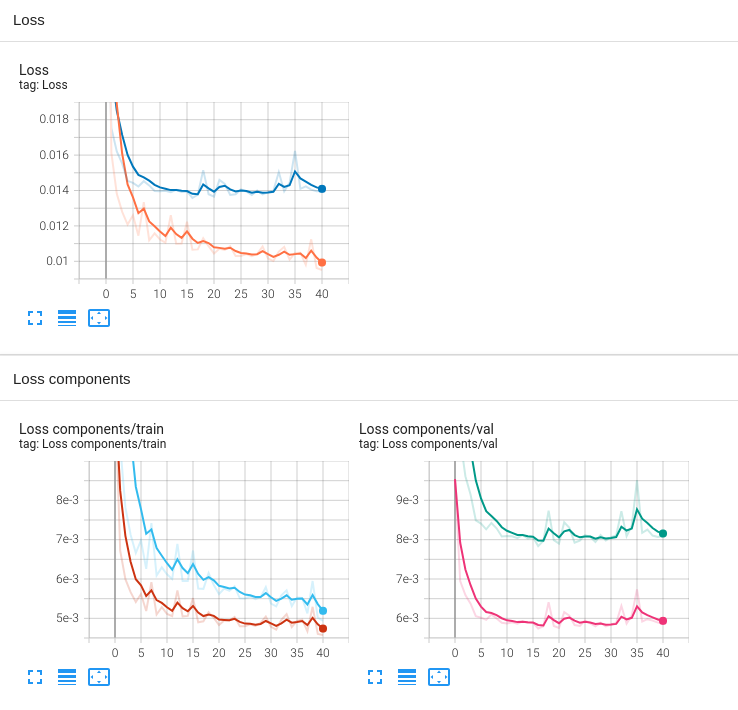
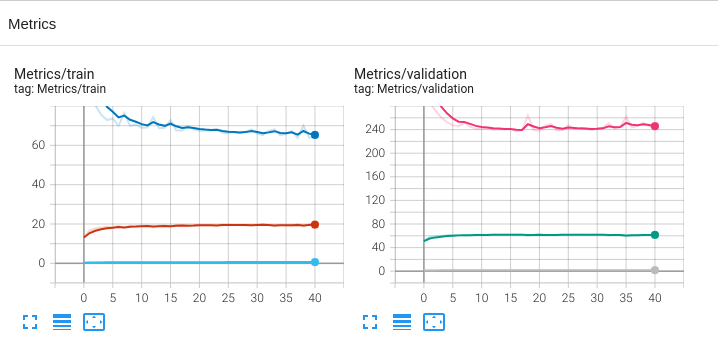
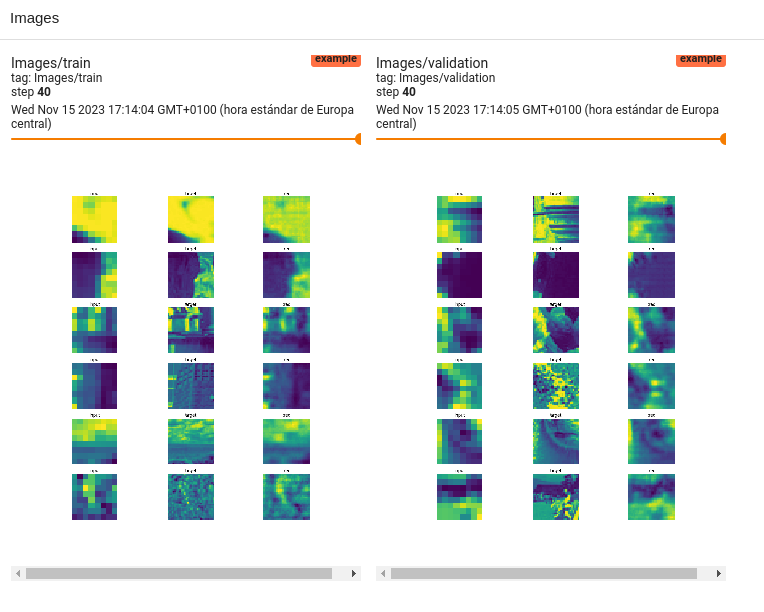

# ml-template
This repository is a template for pytorch's projects for image processing.

## Structure
### Input & Output
Structure the code with the following rules:
1. Dataset's \_\_getitem\_\_ should return a dict
2. Model's forward input params should match Dataset's \_\_getitem\_\_ output keys
3. Model's forward should return a dict
4. Loss' forward input params should match Model's and Dataset's output keys
5. Metrics' update input params should match Model's and Dataset's output keys
6. Loss should return 2 parameters, the loss and the components in a dict
7. Metrics should return a dict


### Classes' examples
The required parts of the templates are in the following classes
1. Datasets
    ```python
   from torch.utils.data import Dataset
 
   class DatasetExample(Dataset):
       def __init__(self, fold, **kwargs):
           super(DatasetExample, self).__init__()
           
   
       def __getitem__(self, index):
           input = ...
           target = ...
           ...
           return dict(input=input, target=target)  # TODO: modify output
   
       def __len__(self):
           return len(...)
    ```
2. Models
    ```python
   import torch.nn as nn
   class NetExamples(nn.Module):
    def __init__(self, upscale_factor):
        super(NetExamples, self).__init__()
        ...

    def forward(self, **kwargs):
        x = kwargs['input']
        x = self.relu(self.conv1(x))
        ...
        return dict(pred=x)

    ```
3. Loss
    ```python
   from torch.nn import Module, L1Loss, MSELoss
   class L1MSE(Module):
       def __init__(self, alpha, **kwargs):
           super(L1MSE, self).__init__()
           self.alpha = alpha
           self.l1 = L1Loss()
           self.mse = MSELoss()
   
       def forward(self, **kwargs): 
           pred = kwargs['pred']  # TODO: match w Dataset & Model output's dict
           target = kwargs['target']
           mse = self.mse(target, pred)
           l1 = self.alpha * self.l1(pred, target)
           loss = l1 + mse
   
           return loss, dict(l1=l1.item(), mse=mse.item())   # TODO: modify output as needed
    ```
4. Metrics
    ```python
   class MetricCalculator(dict):
       def __init__(self, dataset_len, **kwargs):
           super().__init__()      
           self.len = dataset_len
           self.dict = {'ergas': 0, 'psnr': 0, 'ssim': 0, 'sam': 0} # TODO: modify metrics
       
       def add_metrics(self, **kwargs):
           pred = kwargs['pred']  # TODO: match w Dataset & Model output's dict
           target = kwargs['target']
           ...  

    ```
5. TensorboardWriter
    ```python
   class TensorboardWriter:
       ...
       def _image_transform(self, image):
           # TODO: add transforms depending on self.model_name or self.dataset_name
           return image
    ```
6. CSVWriter
    ```python
   class FileWriter:
       ...
       def _image_transform(self, image):
           # TODO: add transforms depending on self.model_name or self.dataset_name
           return image
    ```
### Env file
Add an .env file in the project's root path with the following envariables
```ini
DATASET_PATH="" # path to find all de datasets
SAVE_PATH="" # path to save tensorboard data
EVAL_FREQ=100  # % frequency to print to tensorboard
```

## Features
### Command-line interface
### Tensorboard 
You will get without more implementation the following charts, stored under the path
```python
f"{os.environ['SAVE_PATH']}/{dataset}/{dt.now().strftime('%Y-%m-%d')}/{model}"
```

#### Scalars


#### Images

#### Params & Best Metrics

### CSV writer

